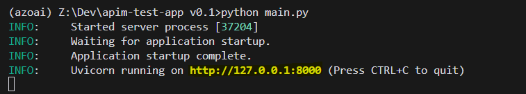

# AI Chat Application


## Description

This AI Chat Application is a lightweight (Python fastAPI), user-friendly interface for testing with an AI model via Azure APIM with subscription keys.

Response headers are captured and displayed in the Iterations windows. Showing token usage, the region is serviced by etc.

- Simple and intuitive chat interface for front end testing
- Two modes basic and advanced with different iterations from provided .csv file 
- Real-time AI responses (only displays first sentance") with headers captured
- Lightweight implementation using basic language features and standard library

## Getting Started

### Prerequisites

- Git
- Python 3.7 or higher
- Conda (recommended for virtual environment management)

### Installation

1. Clone the repository:
   ```bash
   git clone https://github.com/yourusername/ai-chat-app.git
   cd ai-chat-app
   ```
2. Rename the `config-example.json`  `config.json` 

3. Create and activate a virtual environment using Conda:
   ```bash
   conda create -n ai-chat-env python=3.11
   conda activate ai-chat-env
   ```

4. Install dependencies:
   ```bash
   pip install -r requirements.txt
   ```

### Running the Application


1. Activate the virtual environment (if not already activated):
   ```bash
   conda activate ai-chat-env
   ```

2. Run the main application script:
   ```bash
   python main.py
   ```

3. Control click the local server url
 

The application window should open in default browser 

### First-Time Setup

When running the application for the first time, you'll need to configure the settings:

1. Launch the application:
   ```bash
   python main.py
   ```
1a. Control click the local server url
 

2. Click on the "Settings" button or menu option.

3. In the Settings window:
   - Enter your Azure API endpoint URL
   - Input your Azure API key
   - Select the appropriate API version
   - Enter the AI model names you want to use, delete examples. 

4. Click "Update Configuration" to store your settings.

5. Click "Back to chat" 

Note: Your APIM settings will be saved in the `config.json` file. This file is gitignored to prevent accidental commits of sensitive information.

Models are storted in models.txt 

## Usage

Basic Mode:
1. Type your message in the input field at the bottom of the window.
2. Press Enter or click the Send button to submit your message.
3. The AI's response (only first sentance") will appear in the window beow with some of the resonse headers.

Advanced Mode.
Will select user and system messages from the messages.csv
 - To randomly re-order csv click "Randomize CSV" button
 - Set the desired number or itterations (messages to send)
 - clcik "Send"
 Each completed response (first sentance + response headers) in turn will display in the Iterations windows below.

Disclaimer:
This is a simple tool for testing and learning. It is not intended for production use.


